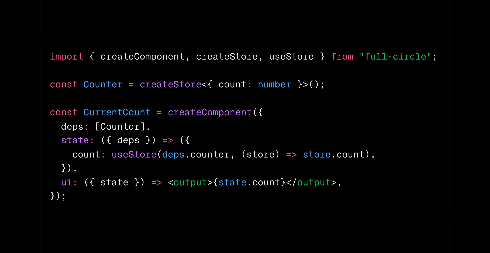

<p align="center">
  
</p>

<h1 align="center">Full Circle</h1>
<p align="center">A library for building readable, performant, type-safe React components</p>

## Why?

The goal of this project is to create:

1. Components that are easy to read & understand
2. Performant state management that is tracked by the type system

### Easy & Readable

Modern React code is far too often a poorly mixed soup of business logic and UI that becomes increasingly difficult for humans and agents to read as it grows in length and complexity. It doesn't have to be this way.

React was introduced with a simple idea: UI is a function of state. Full Circle
returns to that idea. A component's `ui` is literally a function
of the value returned by `state`.

By enforcing this pipeline:

1. `deps` declares the dependencies a component needs.
2. `state` contains business logic.
3. `ui` renders the result of `state`.

We gain a much clearer view of how our components work, and what they depend on.

### State Management

React's context API is an incomplete solution to the problem of state management. It has inherent performance issues and does not include context dependencies in the type system. There is no way to see what contexts a component depends on without looking directly at the code. Full circle addresses this by using selector functions, and by tracking dependencies in the component type signature.

With React context, subscribing to a context subscribes you to all changes in that context, even if you only need a small piece of it. This causes unnecessary re-renders and leads to performance issues. With full circle, you only subscribe to the piece of the store you actually need. If your selector functions output doesn't change, you don't re-render.

Dependency tracking is solved under hood by [effect](https://www.effect.website/). When you add a store to the `deps` list, you will see it listed as a requirement in the component's type signature. If you use the component inside another component, that dependency will bubble up to the new parent component. If you wrap these dependent components with the Store, then the parent component's dependency will go away. By wrapping your applications root component with `toStandaloneComponent` (see example below), you assert that all dependencies are satisfied at compile time, instead of run time.

## Installation

```sh
ni full-circle
```

```sh
pnpm add full-circle
```

```sh
bun add full-circle
```

```sh
npm install full-circle
```

## Setup

Add the Full Circle plugin before React in your Vite config. React Compiler is recommended so the `state` and `ui` functions are compiled like ordinary hooks and components.

```ts
import react from "@vitejs/plugin-react";
import { fullCircle } from "full-circle/vite";
import { defineConfig } from "vite";

export default defineConfig({
  plugins: [
    fullCircle(),
    react({
      babel: {
        plugins: ["babel-plugin-react-compiler"],
      },
    }),
  ],
});
```

The Vite plugin performs Full Circle's requirement analysis during development and production builds. Ordinary `tsc` continues to check the rest of your application; Full Circle does not replace it.

For exact dependency-aware types and hovers in your editor, add the optional TypeScript language-service plugin:

```json
{
  "compilerOptions": {
    "plugins": [{ "name": "full-circle/typescript" }]
  }
}
```

## Example

```tsx
import { useState } from "react";

import {
  createComponent,
  createStore,
  defineProps,
  toStandaloneComponent,
  useStore,
} from "full-circle";

const Counter = createStore<{
  count: number;
  increment: () => void;
}>();

const CurrentCount = createComponent({
  deps: [Counter],

  state: ({ deps }) => ({
    count: useStore(deps.counter, (store) => store.count),
  }),

  ui: ({ state }) => <output>{state.count}</output>,
});

const CounterButton = createComponent({
  deps: [Counter],

  props: defineProps<{
    className?: string;
    label: string;
  }>(),

  state: ({ deps, props }) => ({
    ...props,
    increment: useStore(deps.counter, (store) => store.increment),
  }),

  ui: ({ state }) => (
    <button className={state.className} onClick={state.increment} type="button">
      {state.label}
    </button>
  ),
});

const CounterApp = createComponent({
  state: () => {
    const [count, setCount] = useState(0);

    return {
      count,
      increment: () => setCount((current) => current + 1),
    };
  },

  ui: ({ state }) => (
    <Counter implements={() => state}>
      <CurrentCount />
      <CounterButton label="Increment" />
    </Counter>
  ),
});

// Returns an ordinary React component. Full Circle's Vite analysis reports an
// error if any store requirement remains unsatisfied at this boundary.
export const App = toStandaloneComponent(CounterApp);
```
